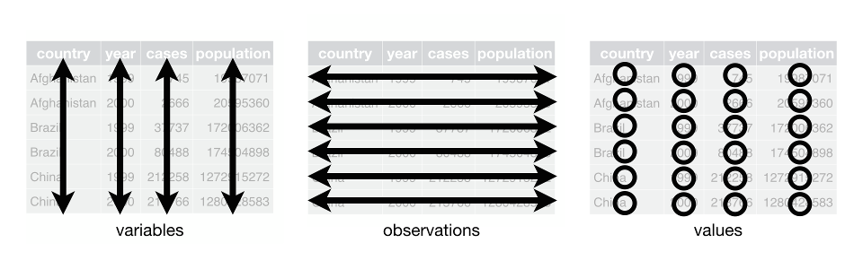

## Introduction

### R and RMarkdown

If you are seeing this text, you have likely correctly setup RStudio
Cloud. Currently you are in a file called an RMarkdown document. It
is written in a mixture of markdown (white background) and code blocks
(grey background). All of the text and code is editable. In order to
run code within a block, click the green arrow button in the upper
lefthand side of the block. For example, try to get R to compute the
sum of 2 and 2 in the code below:

```{r}
2 + 2
```

You should see the output print within the document when you click on
the green arrow. (A common question when doing this is to worry about
why there is a 1 in brackets to the left of the answer. This simply a
counter letting you know that this is the first result.)

One of the strengths of the R programming is the availablity of a
large set of high-quality third-party resources known as 'packages'.
These extend the base language to implent an extremely wide range of
analyses, visualizations, models, and other extensions. Loading packages
involved running code that looks like the block below.

```{r, message = FALSE}
library(readr)      # this package helps reading in datasets
library(ggplot2)    # this one is used for graphics
```

Note that if these are not yet installed, you can do so by clicking on
the dialog at the top of the RMarkdown file.

### What is 'data'?

In this workshop, we will explicitly work with data in a tabular format.
In order to understand what follows, it will be nessisary to have some
terminology about tabular data.

Tables of data have **observations** stored in rows and **variables**
stored in columns. The individual elements are called **values**. So,
each row represents a particular object in our dataset and each column
represents some feature of the objects.



Let's look at a dataset of photographs taken by the U.S. Federal Government from 1935
through 1942 as part of the FSA-OWI Photographic Division:

```{r, message = FALSE}
photos <- read_csv("data/photo_metadata_20200707.csv")  # read in the dataset
photos                                                  # print the dataset
```

The observations here are *photographs* and the variables include:
`call_number`, `photographer`, `lon`, `lat`, `year`, and  month`.
Each variable measures something about a given observation. What
exactly constitutes a row of the data is called a **unit of analysis**.
Keeping in mind what the unit of analysis is will be very
important as we think about how data is being used.
